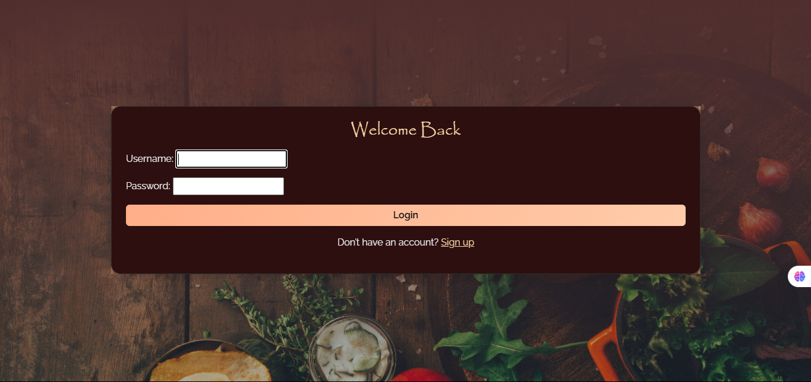
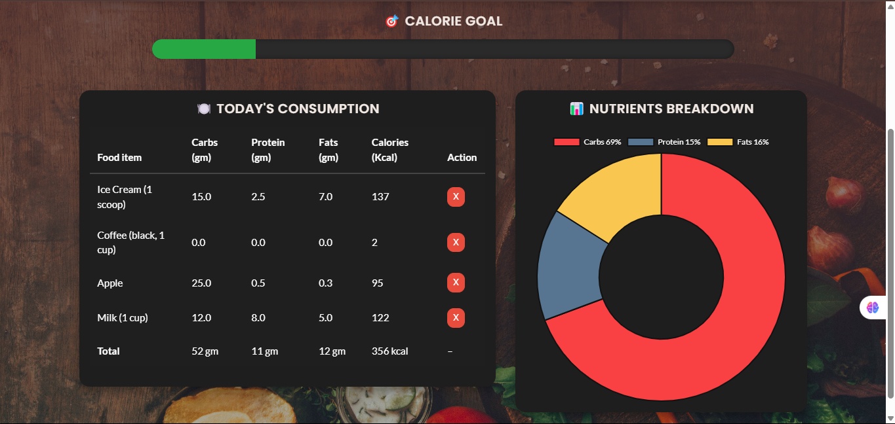
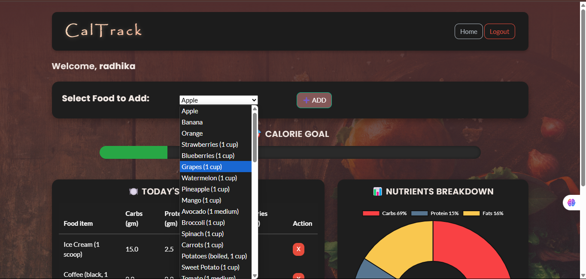
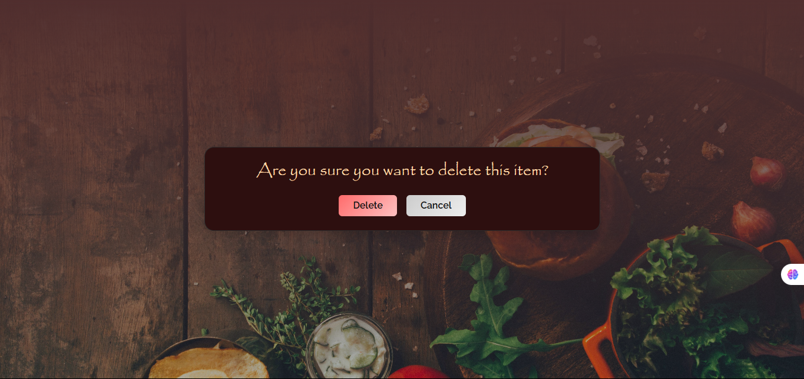

# 🥗 Calorie Tracker

A stylish, dark-themed web app built with **Django** that lets users track their calorie intake. Log meals, monitor daily totals, and visualize your data using Chart.js — all wrapped in a modern, aesthetic UI.

---

## 🌟 Features

- 🔐 User authentication (Sign Up / Login / Logout)
- 📝 Add, view, and delete food items
- 📊 Visual calorie data with Chart.js
- 🎨 Fully themed with Bootstrap 5 & custom CSS
- 🌈 Responsive and mobile-friendly design

---

## 🛠️ Tech Stack

- **Backend:** Django 4.x
- **Frontend:** Bootstrap 5, Chart.js, Custom CSS
- **Database:** SQLite (default with Django)
- **Templating:** Django Template Language (DTL)

---

## 📸 Screenshots
### 🔐 Login Page


### 📈 Dashboard - Index 1


### 📊 Dashboard - Index 2


### 🗑️ Delete Entry

---

## 🚀 Getting Started

### 1. Clone the repository

```bash
git clone https://github.com/your-username/calorie-tracker.git
cd calorie-tracker
```

### 2. Create and activate a virtual environment

```bash
python -m venv venv
source venv/bin/activate  # On Windows: venv\Scripts\activate
```

### 3. Install dependencies
```bash
pip install -r requirements.txt
```

### 4. Apply migrations
```bash
python manage.py migrate
```
### 5. Run the development server
```bash
python manage.py runserver
```
### 6. Access the app
Open your browser and go to: http://127.0.0.1:8000/
